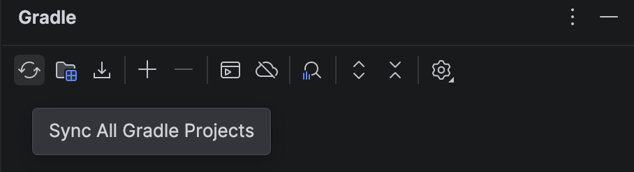

This page links to homework assignments.

Assignments are due by 11:59 PM on the due date, although I will **NOT** assess a late penalty if you submit your final version by 7:00 AM the following morning. 

**All assignment submissions MUST be done using the IntelliJ Plugin** (see [Resources](../resources/index.html) for installation instructions).

> Assignment | File | Due
> ---------- | ---- | ---
> [Assignment 1: Disk Game](assign01.html) | [CS201\_Assign01\_Gradle.zip](CS201_Assign01_Gradle.zip) | MS1 due Wed, Sep 9th MS2 due Sun, Sep 20th
> [Assignment 2: Tic Tac Toe](assign02.html) | [CS201\_Assign02\_Gradle.zip](CS201_Assign02_Gradle.zip) | MS1 due Thur, Oct 1st MS2 due Mon, Oct 12nd
> [Assignment 3: Klondike](assign03.html) |  [CS201\_Assign03\_Gradle.zip](CS201_Assign03_Gradle.zip) | MS1 due Wed, Oct 21st MS2 due Thur, Nov 5th
> [Assignment 4: Mandelbrot Set Renderer](assign04.html) | [CS201\_Assign04\_Gradle.zip](CS201_Assign04_Gradle.zip) | MS1 due Mon, Nov 16th   MS2 due Tue, Dec 1st

# Please check [this link](IntelliJ.pdf) for detailed instructions on how to import a lab project into IntelliJ IDEA.

# Procedure to Fix the Gradle Sync Error in IntelliJ IDEA

After importing your lab project into IntelliJ IDEA, follow the steps below to make sure the project is configured correctly.

## 1. Sync the Gradle Project

After importing the lab into IntelliJ IDEA, the project may automatically sync with Gradle. If the project doesn't automatically sync, you can manually sync it by following these steps.

Find the Gradle icon on the right-side toolbar.

> 

Click the Gradle icon to open the Gradle panel. Then click the first icon on the left, which is the Sync/Reload Gradle Project button.

> 

Wait for IntelliJ IDEA to finish syncing the project.

If you do not see any error messages, you are all set and can start working on your lab.

If you see a Gradle error, similar to the example below, continue with the following steps.

> 

## 2. Open build.gradle

Find and open the build.gradle file in your project.

There are two changes you need to make in this file.

### Change 1: Replace jcenter() with mavenCentral()

Around line 19 of the build.gradle file, you should see:

jcenter()

Comment out or delete jcenter(), and add mavenCentral() in its place.

For example:

// jcenter()
mavenCentral()

> 

### Change 2: Update mainClassName

Near the end of the build.gradle file, you should see something similar to:

mainClassName = "..."

First, remove Name so that mainClassName becomes mainClass:

mainClass = "..."

Then, put this line inside an application { } block:

application {
    mainClass = "..."
}

Make sure the application { } block is placed at the top level of the build.gradle file, not inside another block.

> 

## 3. Save and Sync Again

After making both changes:

- Save the build.gradle file.
- Find the Gradle icon on the right-side toolbar again.
- Click the Gradle icon.
- Click the Sync/Reload Gradle Project icon again.
- Wait for the Gradle sync to finish.

If the sync finishes without an error message, the problem has been fixed. You can now start working on your lab.
