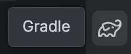
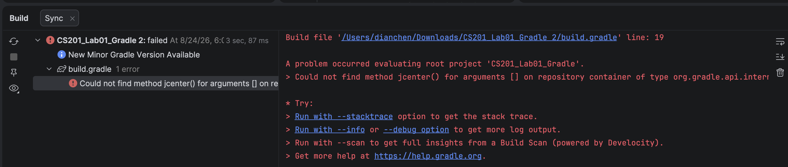
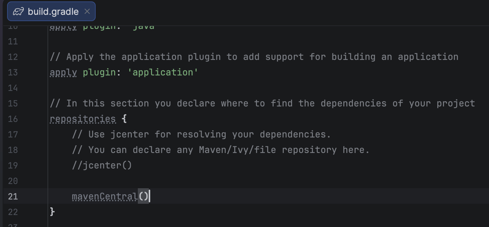
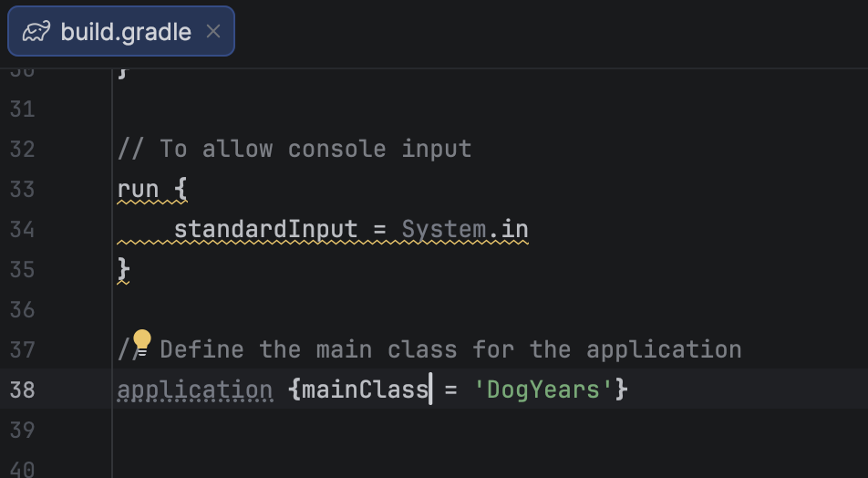

This page lists the lab activities.

In order to receive credit for completing a lab, you need to get a sign-off from your instructor or a tutor by demonstrating your completed lab *in person* (or *virtually* if you are fully remote). **Note:** Simply submitting the lab to Marmoset is *not* sufficient. There are two options for this:

1. For 100% of full credit: Get a sign-off by the end of the *next* week after the lab.
2. For 80% of full credit: Get a sign-off **prior to the class before the next exam.**

Any labs not completed by the exam they precede will receive no credit.

<b>Protip</b>: Work on the labs <i>before</i> coming to class.  This will allow you to ask good questions when we work on the lab in class, and will give you a much better chance of finishing the lab in class.

<b>Make sure you have set up the outer project directory properly as described in the Resources tab.</b>

# Please scroll to the bottom of the page to find the Gradle troubleshooting guide.

# Procedure to Fix the Gradle Sync Error in IntelliJ IDEA

After importing your lab project into IntelliJ IDEA, follow the steps below to make sure the project is configured correctly.

## 1. Sync the Gradle Project

After importing the lab into IntelliJ IDEA, the project may automatically sync with Gradle. If the project doesn't automatically sync, you can manually sync it by following these steps.

Find the Gradle icon on the right-side toolbar.

> 

Click the Gradle icon to open the Gradle panel. Then click the first icon on the left, which is the Sync/Reload Gradle Project button.

> 

Wait for IntelliJ IDEA to finish syncing the project.

If you do not see any error messages, you are all set and can start working on your lab.

If you see a Gradle error, similar to the example below, continue with the following steps.

> 

## 2. Open build.gradle

Find and open the build.gradle file in your project.

There are two changes you need to make in this file.

### Change 1: Replace jcenter() with mavenCentral()

Around line 19 of the build.gradle file, you should see:

jcenter()

Comment out or delete jcenter(), and add mavenCentral() in its place.

For example:

// jcenter()
mavenCentral()

> 

### Change 2: Update mainClassName

Near the end of the build.gradle file, you should see something similar to:

mainClassName = "..."

First, remove Name so that mainClassName becomes mainClass:

mainClass = "..."

Then, put this line inside an application { } block:

application {
    mainClass = "..."
}

Make sure the application { } block is placed at the top level of the build.gradle file, not inside another block.

> 

## 3. Save and Sync Again

After making both changes:

- Save the build.gradle file.
- Find the Gradle icon on the right-side toolbar again.
- Click the Gradle icon.
- Click the Sync/Reload Gradle Project icon again.
- Wait for the Gradle sync to finish.

If the sync finishes without an error message, the problem has been fixed. You can now start working on your lab.

