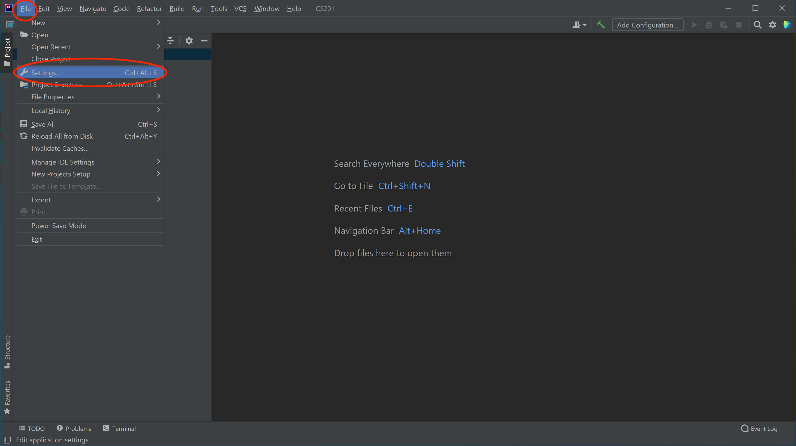
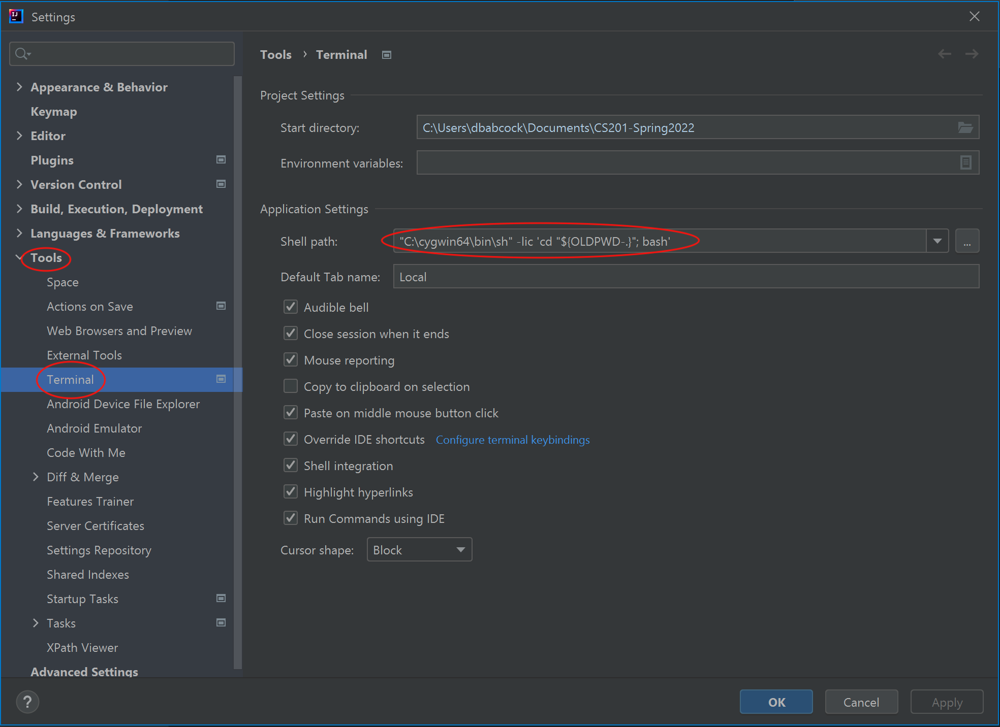
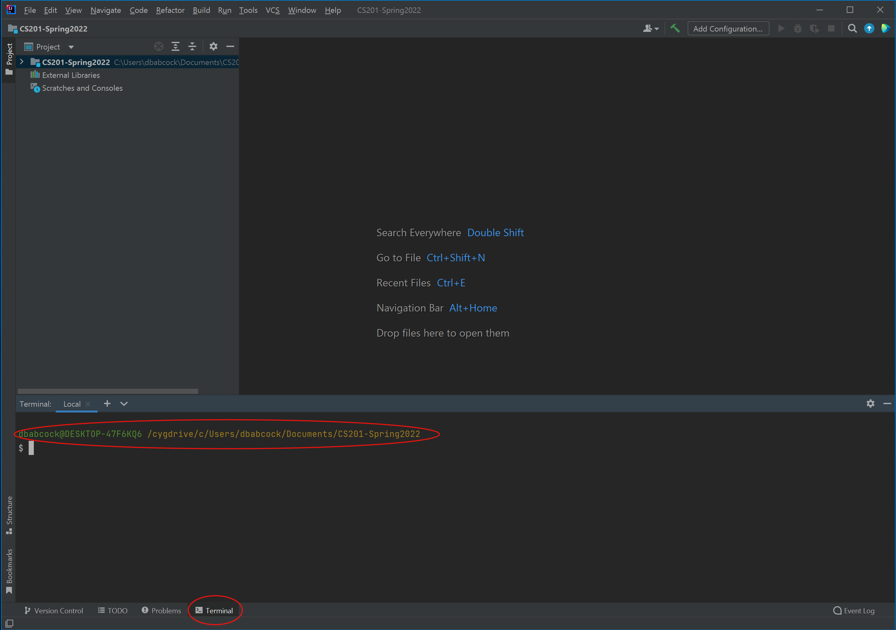

This page has links to useful resources for the course.

<div class="callout">
<b>It is critical that you follow these instructions carefully and set up the environment EXACTLY as described.</b>
</div>

## Java and IntelliJ

All of the software we are using is open source (free). I encourage you to download it to install on your own computer.

-   [Java Development Kit](https://www.oracle.com/java/technologies/javase-downloads.html): This is required to run Java programs. Make sure you download the JDK appropriate for your operating system, e.g. **macOS Installer** or **Windows x64 Installer**.
-   [IntelliJ IDEA](https://www.jetbrains.com/idea/): This is the Java development environment we are using in class. It has a number of versions, but the free **Community** edition is sufficient for this course.

## Initial Setup

Create a folder named **CS201-Fall2026** in a location where you can easily find and access it throughout the semester. For example:

* **Windows:** `C:/Users/user/Documents/CS201-Fall2026`
* **macOS/Linux:** `~/Documents/CS201-Fall2026`

**BE SURE THE LOCATION DOES NOT CONTAIN A SPACE IN THE PATH**, or you may have issues later when setting up and using the IntelliJ terminal if we need to use it.

Throughout the semester, whenever you create a new **lab or assignment**, place it inside the **CS201-Fall2026** folder. Keeping all of your CS201 work in this folder will help you stay organized and make your projects easier to find.

## Setting up a Submission Plugin

All labs, assignments, and exams will be submitted to the [Marmoset submission server](https://cs.ycp.edu/marmoset) through the IntelliJ IDEA plugin.

In IntelliJ, find the gear (Settings) icon near the top-right corner. Click the icon and select Plugins....

In the Plugins window, use the search bar to search for:

	''YCPCS Marmoset Submitter''

Install the plugin and make sure it is enabled.

Once the plugin has been successfully installed and enabled, you should see a new Marmoset Submitter icon near the top-right corner of IntelliJ.


## Submitting Your Lab or Assignment

After you have completed your lab or assignment and are ready to submit it, simply click the Marmoset Submitter icon.

A login window will appear. Enter your Marmoset account username and password and follow the prompts to submit your work.

If your submission is successful, you should see a message indicating that the submission was successful.

Once you see the successful submission message, you are all set!

<!--
### Windows 10

We will be using [Cygwin](http://cygwin.com/) as our terminal program. 

Make sure you have first installed IntelliJ and set up your **CS201-Fall2026** project as described above. If you already installed Cygwin for CS101, skip to step 2.

1. Install [Cygwin](http://cygwin.com/) and the various packages as described in the [CS101 Cygwin installation guide](https://ycpcs.github.io/cs101-spring2021/installCygwin.html). **MAKE SURE YOU HAVE ALL THE PACKAGES INSTALLED** (specifically zip, unzip, make, perl, curl, and openssh).

2. Open IntelliJ and the **CS201-Fall2026** project, then select **File -> Settings** from the menubar.

    

3. In the **Settings** dialog, select the **Tools->Terminal** option, then replace what is in the **Shell path:** setting with

    <pre>
    "C:\cygwin64\bin\sh" -lic 'cd "${OLDPWD-.}"; bash'
    </pre>

    

4. If everything is configured correctly, when you select the **Terminal** tab in the lower left corner of IntelliJ (you may need to do this twice), it should open up a terminal pane that displays a Cygwin prompt in the **CS201-Spring2022** project directory.

    

### Mac OSX

1. From the Mac App store, download and install XCode. Run the application which will complete the installation process. **Note:** If you have a new M1-based Mac, you will also need to install Rosetta as part of installing XCode.

2. Open the **Terminal** application from the launchpad (it may be in the **Other** folder) and install the command line tools using

	```cpp
	$ sudo xcode-select --install
	``` 

### Submitting to Marmoset

All labs, assignments, and exams will be submitted to the [Marmoset submission server](https://cs.ycp.edu/marmoset) through the IntelliJ IDEA Terminal. To open the Terminal, at the bottom of the IntelliJ window click the **Terminal** menu item which should open the Terminal in the lower IDE pane. Navigate into the proper folder and type 

```cpp
$ make submit
```

then enter your Marmoset username and password and verify that the submission was successful.

### Terminal commands

A few useful terminal commands are

> -   **ls** - list the files/directories in the current location
> -   **cd ..** - change directory to the parent directory of the current location
> -   **cd** *[directory]* - change directory to the child directory named *[directory]*

-->
